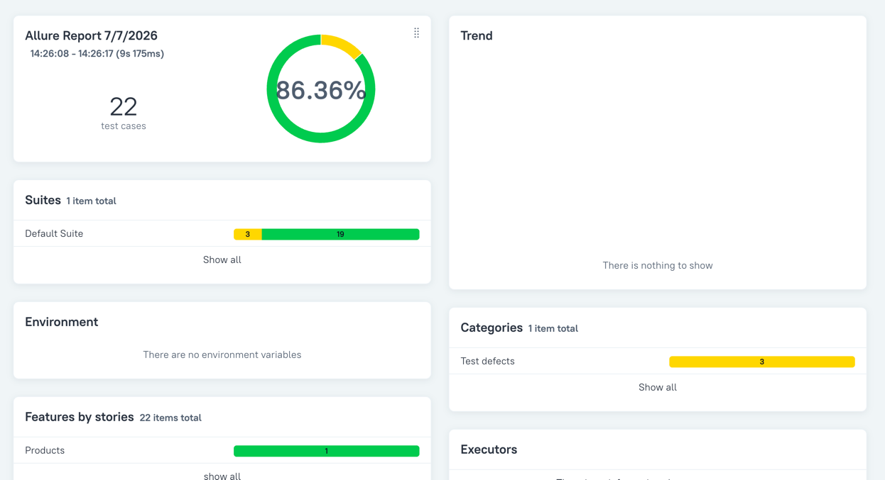
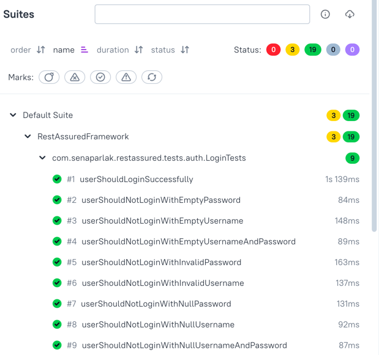
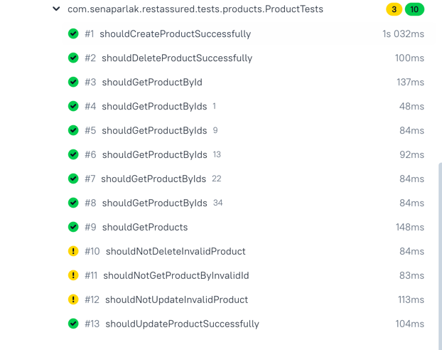
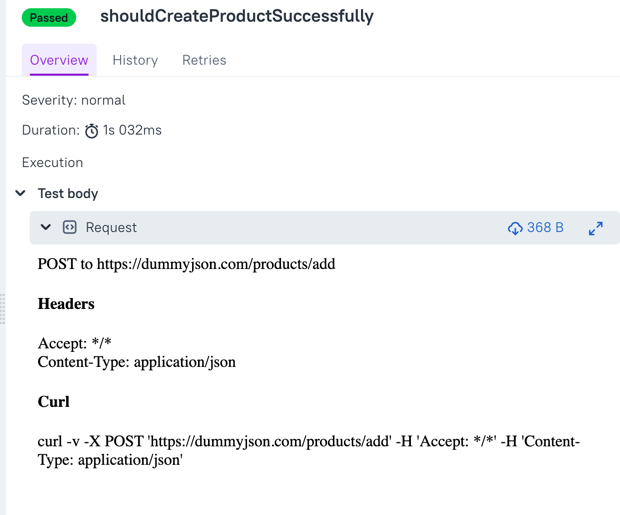
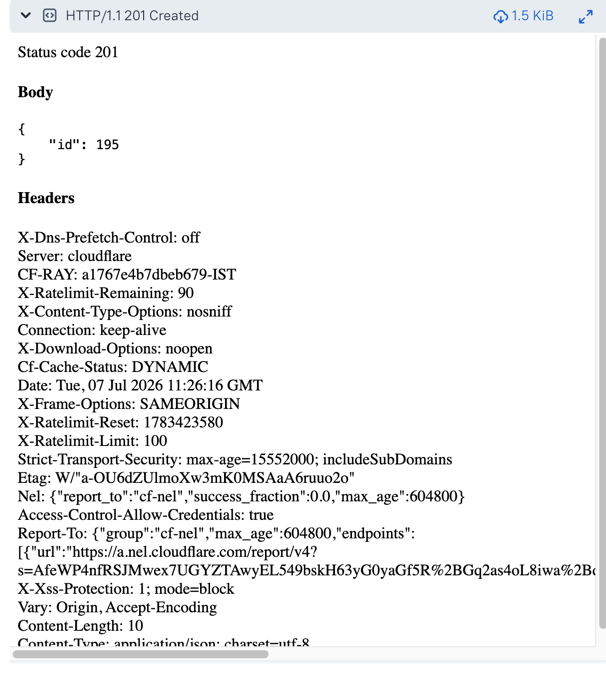

## DummyJson RestAssured Framework

API Test Automation Framework developed using Rest Assured and TestNG for testing DummyJSON REST APIs.

The framework follows a clean layered architecture including Service Layer, Request/Response Specifications, POJO Mapping, Builder Pattern and Allure Reporting.

Tech Stack
------------
* Java 17
* RestAssured
* TestNG
* Maven
* Lombok
* DataFaker
* Allure Report

## Features

- REST Assured API Testing
- TestNG Test Framework
- Service Layer Architecture
- POJO Mapping (Jackson)
- Builder Pattern
- Request Specification
- Response Specification
- Data Provider
- DataFaker Integration
- Positive & Negative Test Scenarios
- Allure Reporting

### Allure Dashboard



### Test Suites




### Test Details




## Run Tests

Run all tests:

```bash
mvn clean test
```

Generate and open the Allure report:

```bash
allure serve allure-results
```

## Author
**Mehpare Sena Parlak**

* GitHub: https://github.com/senaparlak
* Linkedin: https://www.linkedin.com/in/mehparesenaparlak